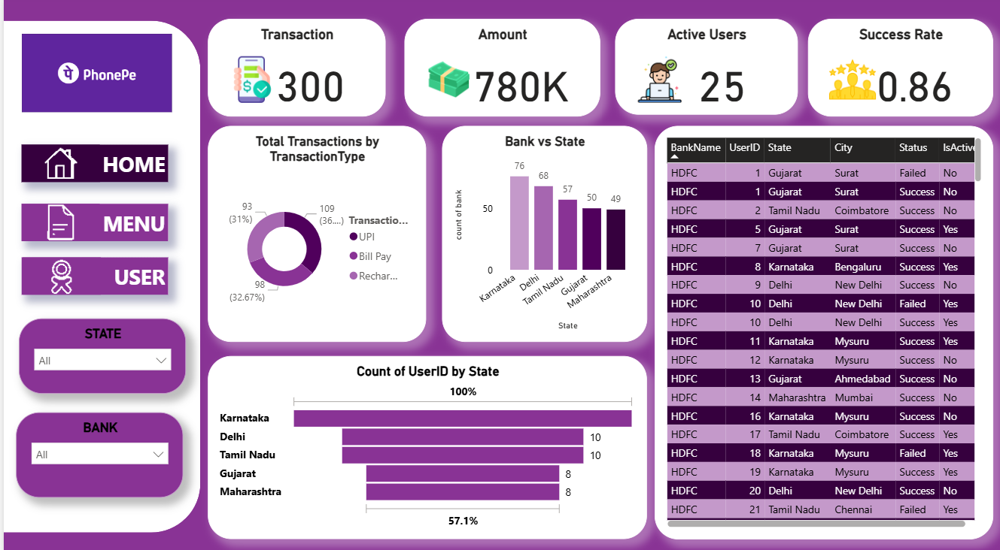

This project analyzes PhonePe digital payment transactions using Power BI to gain insights into transaction trends, user behavior, and state-wise performance across India.

The dashboard provides an interactive and visual understanding of:
- Transaction growth over time
- State-wise transaction distribution
- Transaction types usage
- Top performing states.

## Objectives:
- Analyze monthly and yearly transaction trends
- Identify top states by transaction amount
- Understand transaction types distribution
- Provide a high-level executive overview

## Tools & Technologies Used:
- Power BI
- Excel Dataset
- DAX
- Power Query
- Data Modeling

## Dataset Details:
The dataset includes:-
- Transaction Date
- State
- Transaction Amount
- Transaction Count
- Transaction Type

## Problem Statement
PhonePe handles millions of digital transactions across India.
The objective of this project is to analyze transaction data to:
- Track transaction growth over time
- Identify top-performing states
- Understand transaction type usage
- Provide business-ready insights for decision making

## DAX Measures Used
The following DAX measures were created to support dashboard calculations:

## DAX
- Total Transactions:
  Total Transactions = COUNT(Transactions[TransactionID])
  
- Total Transaction Amount:
  Total Amount = SUM(Transactions[Amount])
  
- Active Users:
  Active Users = CALCULATE(DISTINCTCOUNT(Users[UserID]),Users[IsActive] = "Yes")
  
- Success Rate:
  Success Rate =
  DIVIDE(CALCULATE
  (COUNT(Transactions[TransactionID]),Transactions[Status] = "Success"),
      COUNT(Transactions[TransactionID])
  )

## 📸 Report Screenshots

### 1️⃣ Menu Page

### 2️⃣ Transaction Page

### 3️⃣ User Page

### 4️⃣ Tooltip Page

## 👤 Created By
**Diksha Parit**  
Aspiring Data Analyst | Power BI Developer

